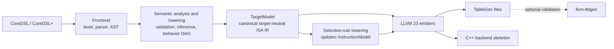

# CoreDSL Backend Generator Design

## Status and scope

This document defines the design of `coredsl-backend-gen`.  It is the source
of truth for the new implementation; the previous CoreDSL2LLVM-derived code
and designs are explicitly out of scope.

The tool consumes a CoreDSL instruction-set description and produces a
target-neutral, inspectable model.  Later stages use that model to generate a
minimal LLVM 23 backend: TableGen descriptions that accurately represent
registers and instructions, and C++ scaffolding sufficient to bring up
GlobalISel.  LLVM is **not** part of the generation pipeline.  An LLVM build
and `llvm-tblgen` are optional validation tools for generated output only.

The initial reference target is a deliberately generic `Tiny32`, not RISC-V.
It is a 32-bit little-endian fixed-width ISA with one GPR file, one register
class, and one register bank.

## Goals

- Parse current CoreDSL without LLVM IR, target, CodeGen, or pass-pipeline
  dependencies; LLVM Support is available for frontend infrastructure.
- Preserve source locations and emit deterministic diagnostics.
- Produce a typed, target-neutral IR (`TargetModel` and `SemanticGraph`) that
  is stable across LLVM versions.
- Derive instruction length, encoding, operands, assembly syntax, basic
  instruction effects, and simple selection patterns from CoreDSL behavior.
- Generate correct register and instruction TableGen for the supported model.
- Generate a minimal LLVM 23 GlobalISel backend skeleton, initially capable of
  selecting Generic MIR up to `-stop-after=instruction-select`.
- Keep LLVM-version-specific syntax and APIs isolated in an LLVM 23 emitter.

## Non-goals for the first release

- Reusing an existing target (especially RISC-V) to discover patterns.
- Translating behavior to LLVM IR, running a TargetMachine, or inspecting MIR
  to reverse-engineer TableGen patterns.
- Object emission, assembler/disassembler, relocations, unwind information,
  branch relaxation, or complete ABI support.
- Inferring architectural facts that CoreDSL cannot express, such as the
  number of physical registers or callee-saved registers.
- Silently emitting a selection rule when behavior cannot be mapped safely.

## Design principles

1. **CoreDSL semantics first.** The generator models the described ISA, rather
   than modelling an LLVM optimization pipeline.
2. **One canonical IR.** Every emitter consumes `TargetModel`; no emitter
   reparses CoreDSL or maintains its own inferred view of the target.
3. **Explicit uncertainty.** A fact is either declared, mechanically derived,
   supplied by a documented MVP default, or rejected.  It is never guessed.
4. **LLVM isolation.** The frontend may use LLVM Support facilities such as
   `MemoryBuffer`, `SourceMgr`, `SMLoc`, `raw_ostream`, and command-line/file
   utilities.  It must not use LLVM IR, TargetMachine, CodeGen, or pass
   infrastructure.  LLVM 23 backend details live only under `Emit/LLVM23`.
5. **Structured generation.** TD files are emitted from typed objects, not by
   concatenating text in the parser.  Fixed C++ boilerplate may use templates.
6. **Determinism.** Diagnostics, model dumps, and generated files have stable
   ordering so they can be reviewed and tested as golden files.

## Architecture



The solid path is self-contained.  The dashed validation step may invoke a
user-provided LLVM 23 `llvm-tblgen`, but it must not affect inference or the
contents of generated files.

## Input language and migration plan

### Phase-1 input: existing CoreDSL plus minimal target options

The first usable implementation accepts the current CoreDSL constructs:

- `InstructionSet` and `instructions`;
- per-instruction `operands`, `encoding`, `assembly`, and `behavior`;
- expressions, assignments, conditionals, and the current architectural state
  access notation such as `X[rd]`, including typed declarations, casts, and
  bit slices used by the reference examples.
- first-class `register tensor` and `memory tensor` types with a shared element
  type and shape representation. Register tensors are one-dimensional, while
  memory tensors may have any positive rank and MLIR-style `?` dynamic
  dimensions.

Current CoreDSL does not specify the complete physical-register and ABI model.
For this phase, those facts are explicitly supplied by command-line options:

```text
coredsl-backend-gen Tiny32.core_desc \
  --target-name=Tiny32 \
  --register-width=32 \
  --register-count=16 \
  --register-prefix=r \
  --zero-register=0 \
  --endianness=little \
  --pointer-width=32 \
  --output=generated/Tiny32
```

The generator verifies that the register count fits operand encoding widths.
For example, a five-bit register field can encode at most 32 physical
registers.  These options are represented in `TargetModel` exactly as declared;
they are not presented as CoreDSL-derived facts.

### Phase-2 language extensions

Once the Phase-1 model is stable, move the target configuration into CoreDSL+.
The extended language must be additive and preserve existing instruction
descriptions where possible.

```text
architecture Tiny32 {
  backend llvm {
    namespace: Tiny32;
    target_name: "tiny32";
    triple: "unknown-unknown-none";
    endian: little;
    pointer_width: 32;
    instruction_alignment: 4;
  }

  register_file GPR {
    width: 32;
    count: 16;
    registers {
      r0  { encoding: 0; constant: 0; reserved: true; }
      r14 { encoding: 14; role: sp; reserved: true; }
      r15 { encoding: 15; role: ra; reserved: true; }
    }
    class GPR32 {
      members: [r0-r15];
      allocatable: [r1-r13];
      types: [i32, p0];
      spill_size: 4;
      spill_alignment: 4;
    }
    bank GPRBank { classes: [GPR32]; }
  }

  operand simm12 { kind: immediate; width: 12; signed: true; }
}
```

Further extensions introduce explicit instruction operands, legalization,
selection rules, ABI, memory, and calling-convention declarations.  Explicit
declarations override inference.

## Canonical target-neutral IR

`TargetModel` is the only input to code generation.  It distinguishes concepts
that are often confused in backend descriptions:

| Concept | Meaning | Example |
| --- | --- | --- |
| Physical register | A concrete architectural register | `r3` |
| Register class | Allocatable set with a value type and spill properties | `GPR32` |
| Register bank | GlobalISel bank grouping classes | `GPRBank` |
| LLT | GlobalISel low-level value type | `s32`, `p0` |

The principal IR objects are:

```text
TargetModel
  RegisterFileModel, RegisterModel, SubRegIndexModel
  RegisterClassModel, RegisterBankModel
  OperandTypeModel, ImmediateTypeModel, MemoryOperandModel
  InstructionFormatModel, EncodingFieldModel, InstructionModel
  LegalizationModel, ABIModel

SemanticGraph
  typed SSA/DAG nodes, memory effects, source provenance

SelectionRuleModel
  inferred, explicit, or custom selection rule for an instruction
```

`InstructionModel` contains the instruction name, bit width, encoding segments,
operands with direction and type, assembly form, effects (`mayLoad`, `mayStore`,
`hasSideEffects`), and an optional `SemanticGraph`/`SelectionRuleModel`.
`SemanticGraph` and `SelectionRuleModel` are therefore owned by the instruction
inside `TargetModel`; they are not parallel emitter inputs.  Endianness, pointer
width, and the resulting LLVM data-layout contract are also explicit target
properties, even when the first tests begin at Generic MIR.

The serialized form, `<target>.model.json`, is a first-class output.  It is the
debugging boundary, the input to future tools, and the artifact used to compare
generator revisions.

## Frontend and semantic analysis

The frontend is a small C++17 recursive-descent parser with these components:

```text
Frontend/ Lexer, Parser, Diagnostics
AST/      Decl, Stmt, Expr
Sema/     RegisterSema, EncodingSema, BehaviorSema, TargetVerifier
```

It links only `LLVMSupport` for source buffers, source locations, diagnostics,
and output.  Its AST retains `SMLoc`-based source ranges; semantic analysis
converts it to the canonical IR and performs the following checks:

- every field referenced by assembly or behavior exists;
- instruction encoding has the declared width, has no overlaps, and has no
  unaccounted bits unless explicitly permitted;
- encoding field sizes agree with immediate and register-index use;
- inferred input/output directions are consistent with behavior;
- register-file capacity fits encoded register fields;
- instruction encodings do not conflict;
- behavior expression types, signedness, and widths are valid;
- declared effects agree with behavior-derived effects;
- later phases additionally validate register-bank membership, legalization,
  ABI roles, and reserved-register rules.

For the following CoreDSL fragment:

```text
encoding: ... rs2[4:0] :: rs1[4:0] :: ... rd[4:0] ...
behavior: X[rd] = X[rs1] + X[rs2];
```

analysis derives `rd` as an output register index, `rs1` and `rs2` as input
register indexes, and their five-bit encoding widths.  An `imm[11:0]` field
used through sign extension is derived as a signed 12-bit immediate.

## Behavior lowering and selection rules

Behavior is lowered to a typed semantic SSA/DAG, never LLVM IR.  For example:

```text
X[rd] = X[rs1] + X[rs2];
```

becomes:

```text
WriteReg(rd, G_ADD(s32, ReadReg(rs1), ReadReg(rs2)))
```

Lowering performs only deterministic normalizations needed to describe the
instruction: explicit extensions/truncations, bit-extract normalization,
constant folding, commutative operand ordering, SSA conversion, and separation
of memory effects.  It is not an optimizer.

Instructions choose one of three modes:

- `select: auto` derives a rule when the semantic graph has an unambiguous
  Generic opcode mapping.
- `select { ... }` provides an explicit rule when automatic derivation is
  ambiguous or insufficient.
- `select: custom` emits an InstructionSelector hook and a clear TODO.

Automatic generation is permitted only for a single final register write, a
single basic block, explicit input operands, known LLTs and generic opcodes,
and fully described effects.  The Phase-1 subset excludes memory, loops,
non-removable control flow, dynamic aliases, and hidden architectural state.
Unsupported instructions still receive a correct instruction definition, but
their pattern is empty and a diagnostic explains why.

The initial operation mapping covers integer arithmetic and shifts:

```text
+  -> add       -   -> sub       *  -> mul
&  -> and       |   -> or        ^  -> xor
<< -> shl       >>u -> srl       >>s -> sra
```

## LLVM 23 emitter contract

The LLVM-facing layer is versioned as `Emit/LLVM23`.  It owns TableGen spelling,
LLVM 23 class names, generated-include conventions, and C++ interface details.
It may contain fixed rules required by LLVM 23, but there are no user-maintained
LLVM-side mapping files: CoreDSL semantics map to the canonical IR, and the
versioned emitter maps that IR directly to output.

Initial generated TD files are:

```text
Tiny32.td
Tiny32RegisterInfo.td
Tiny32RegisterBanks.td
Tiny32InstrFormats.td
Tiny32InstrInfo.td
```

`RegisterInfo.td`, register banks, instruction formats, and `InstrInfo.td` are
the accuracy-critical outputs.  The MVP uses a target-owned instruction base
class and directly emits bit assignments per instruction; it does not reuse
`RVInst`, `RVInst16`, `RVInst48`, or any other target-specific format class.

For the semantic graph above, a generated pattern is conceptually:

```text
let Pattern = [
  (set GPR32:$rd, (add GPR32:$rs1, GPR32:$rs2))
];
```

The C++ skeleton includes `TargetMachine`, `Subtarget`, `InstrInfo`,
`RegisterInfo`, `FrameLowering`, `ISelLowering`, target registration and MC
registration scaffolding, plus:

```text
GISel/<Target>CallLowering
GISel/<Target>LegalizerInfo
GISel/<Target>RegisterBankInfo
GISel/<Target>InstructionSelector
```

The first skeleton supports basic integer Generic operations, one GPR bank, and
no real calls or stack objects.  TableGen-generated selection is preferred;
handwritten selection is only a fallback for copies, PHIs, implicit defs, and
diagnostics.

### Bring-up without LLVM architecture mappings

LLVM 23 normally identifies an in-tree production target through
`llvm::Triple::ArchType`.  Adding a new enum and parser spelling would require
central LLVM source changes.  The MVP deliberately avoids those mappings:

- generate `RegisterTarget<Triple::UnknownArch>` with the unique target-registry
  name `tiny32`;
- configure the source tree with
  `-DLLVM_EXPERIMENTAL_TARGETS_TO_BUILD=Tiny32`, which LLVM 23 accepts for a
  target directory not listed in `LLVM_ALL_TARGETS`; and
- select the backend explicitly with `llc -march=tiny32` while using an unknown
  architecture triple.

Target lookup by explicit `-march` uses the registered target name and does not
require `Triple::getArchTypeForLLVMName` to recognize it.  This keeps bring-up
self-contained: no LLVM-side architecture mapping file and no modifications to
`Triple` are generated or maintained.

Production triple integration is a later, explicit milestone.  If it is ever
required, it is an LLVM integration change rather than part of CoreDSL semantic
analysis, and it must not become an input to TD generation.

## Output layout and command line

```text
coredsl-backend-gen Tiny32.core_desc \
  --llvm-version=23 \
  --output=generated/Tiny32 \
  --emit-model-json --emit-td --emit-backend-skeleton

generated/Tiny32/
  model/Tiny32.model.json
  td/Tiny32.td
  td/Tiny32RegisterInfo.td
  td/Tiny32RegisterBanks.td
  td/Tiny32InstrFormats.td
  td/Tiny32InstrInfo.td
  cpp/...
```

Useful diagnostics and inspection options are `--dump-ast`, `--dump-model`,
`--dump-semantic-graph`, `--strict`, and `--emit-td-only`.  Optional validation
is explicit:

```text
coredsl-backend-gen Tiny32.core_desc \
  --llvm-version=23 \
  --validate-tablegen=/path/to/llvm-tblgen \
  --llvm-source=/path/to/llvm-project
```

Validation invokes TableGen after emission.  It never supplies semantic facts
or changes generated text.

For an in-tree LLVM 23 build, enable the project directly through LLVM's
standard project switch:

```text
cmake -S llvm -B build -DLLVM_ENABLE_PROJECTS=coredsl-backend-gen
cmake --build build --target coredsl-backend-gen
```

This integrates the tool's build target only.  It does not change the
generator's no-pipeline contract.

## Source layout

```text
coredsl-backend-gen/
  docs/Design.md
  include/coredsl/
    AST.h, Diagnostics.h, TargetModel.h, SemanticGraph.h, SelectionRule.h
  lib/
    Frontend/ Lexer.cpp, Parser.cpp, Diagnostics.cpp
    AST/ Decl.cpp, Stmt.cpp, Expr.cpp
    Sema/ RegisterSema.cpp, EncodingSema.cpp, BehaviorSema.cpp, TargetVerifier.cpp
    Lowering/ BehaviorToSemanticGraph.cpp, SemanticGraphToSelection.cpp
    Emit/Common/
    Emit/LLVM23/
  templates/llvm23/
  tools/coredsl-backend-gen/Main.cpp
  examples/ExampleRV32.core_desc
  examples/ExampleRV32K.core_desc
  examples/ExampleRV64.core_desc
  test/Parser/ test/Sema/ test/Model/ test/TableGen/ test/GlobalISel/ test/Golden/
```

## Delivery roadmap

### Milestone 0: freeze the supported contract

Record the accepted existing-CoreDSL grammar, unsupported constructs, minimal
target options, diagnostic rules, and the versioned JSON schema for
`TargetModel`.  Add parser and model fixtures before implementing emitters so
later milestones cannot redefine inferred facts to suit generated TD text.

### Milestone 1: standalone frontend

Implement lexer, parser, diagnostics, AST dump, and tests for existing
CoreDSL.  The acceptance command is:

```text
coredsl-backend-gen example.core_desc --dump-ast
```

No LLVM IR/Target/CodeGen linkage, passes, TD output, or source-tree backend
integration is allowed in this milestone.  `LLVMSupport` is intentionally used
for frontend infrastructure.

### Milestone 2: instruction and target model

Implement encoding/operand/effect inference, semantic validation, minimal
command-line target configuration, and deterministic JSON output:

```text
coredsl-backend-gen example.core_desc --dump-model > example.model.json
```

### Milestone 3: accurate TableGen

Generate and golden-test register, register-bank, instruction-format, and
instruction-info TD files.  Verify them independently with LLVM 23 TableGen:

```text
llvm-tblgen -gen-register-info ...
llvm-tblgen -gen-register-bank ...
llvm-tblgen -gen-instr-info ...
```

### Milestone 4: auto-selection subset

Lower pure single-result integer behavior to `SelectionRuleModel`, emit
patterns, and validate the GlobalISel-generated matcher.  A pattern failure is
per-instruction, never a reason to discard otherwise valid TD output.

### Milestone 5: minimal LLVM 23 backend

Emit the backend skeleton and establish Generic MIR tests first.  The minimum
end-to-end proof is that these generic instructions select to target machine
instructions:

```text
G_ADD, G_SUB, G_AND, G_OR, G_XOR, G_SHL, G_LSHR, G_ASHR
```

The initial test command is conceptually:

```text
llc -march=tiny32 -mtriple=unknown-unknown-none -global-isel \
  -stop-after=instruction-select test.mir
```

Only after MIR instruction selection is stable should the project add LLVM IR
translation, return lowering, memory, control flow, ABI, stack frames, and MC
support.

### Milestone 6: CoreDSL+

Move target configuration into language declarations; add explicit operands,
legalizer, register-bank, ABI, memory, and calling-convention descriptions.
Explicit declarations take precedence over Phase-1 defaults and inferred data.

## MVP acceptance criteria

For `Tiny32`, the MVP is complete when one CoreDSL input and explicit minimal
target options produce:

- a validated, reproducible `Tiny32.model.json`;
- correct physical-register encodings, one register class, and one register
  bank;
- correct instruction bit widths, bit assignments, operand direction/width,
  immediate signedness, assembly strings, and basic effects;
- safe patterns for the supported integer subset;
- TableGen accepted by LLVM 23 validation tools; and
- a generated LLVM 23 backend that selects the covered Generic MIR operations
  before instruction selection stops.

The project deliberately does **not** claim ABI, stack, object-file, assembler,
or complex-control-flow completeness at this point.
